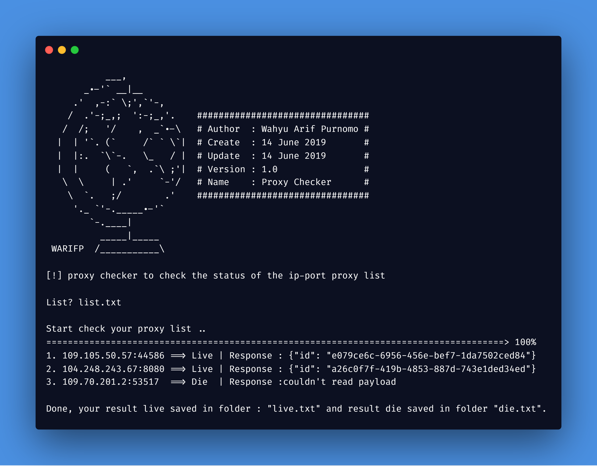

<H1 align="center">
PROXY CHECKER
</H1>
<H4 align="center">
proxy checker to check the status of the ip-port proxy list. 
From API : https://checkerproxy.net/api/check 
</H4>

 

Made with ❤️ by <a href="https://github.com/warifp">Wahyu Arif Purnomo</a>

  

## Version

Version 1.0 :

  Changelog :

-   Build Tools
-   add library CLIMate
## Installation

You can download the latest composer in [here](https://getcomposer.org/download/).

    git clone https://github.com/warifp/ProxyChecker.git

    composer update

## Requirements for using this tool

We need several requirements to use this tool to run smoothly.

##### Linux

##### Windows

## Usage

Enough to execute the command :

    php run.php

and don't forget to ask at [issue page](https://github.com/warifp/FacebookToolkit/issues)
If you have additional information, you can make it on the [issue page](https://github.com/radenvodka/Recsech/issues).

## Thanks

Thank you for all.

1.  CLIMate Library : [CLIMate](https://github.com/radenvodka/Recsech/issues).

## Donation

    If you want to buy my coffee, you can send payments Paypal.

## Disclaimer

This is an open source for everyone, you may redistribute, modify, use patents and use privately without any obligation to redistribute. but it should be noted to include the source code of the library that was modified (not the source code of the entire program), include the license, include the original copyright of the author (warifp), and include any changes made (if modified). Users do not have the right to sue the creator when there is damage to the software or even demand if there is a problem caused by the makers of this tool. because every risk is caused by the user risk itself.
